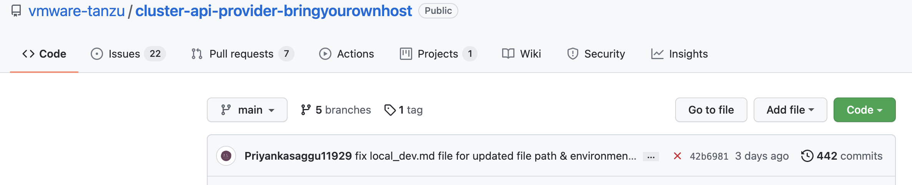
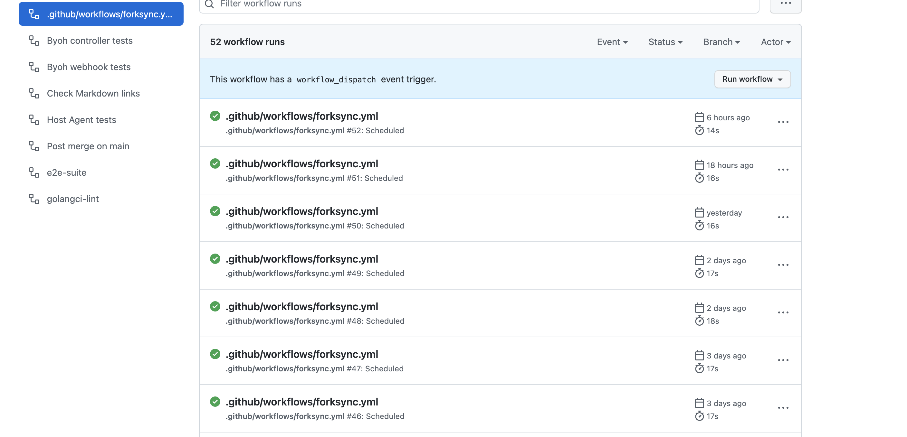
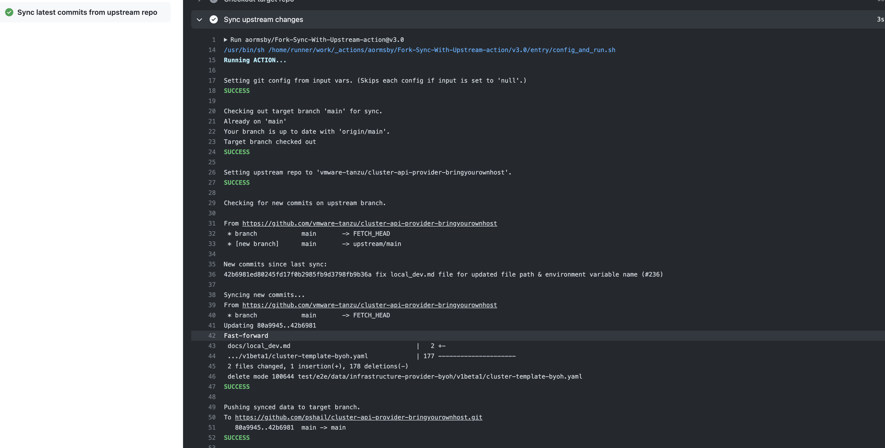
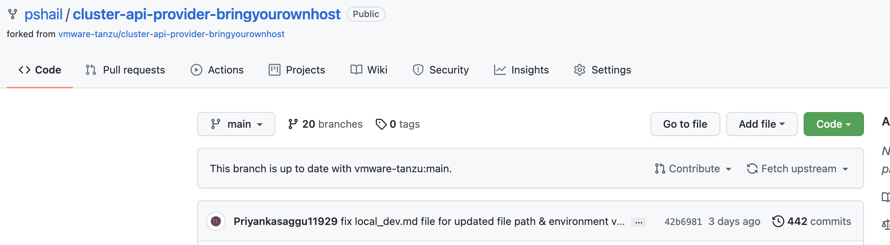

### Objective

I found it quite annonying to discover that my fork is not in sync with upstream when in my local shell i was creating branch for new features. As a ritual i used to pull from my fork only to find that it was not in sync and hence, afaik, left with two options before creating a new branch from main to work:

*   use git ui to fetch upstream and then in local shell pull fork main
    
*   fire a series of git cli command in the shell without opening a browser and then only create a new branch from main
    

What if I could automate this whole process in the fork and all i do is what i inted to do originally, just do git pull and start cracking on the new branch from main

Following is the small automation using github action to sync fork to upstream main, for now periodically via a cron. I intend to further automate so that whenever a push is observerd in upstream main/master fork main is synced.

### Steps

*   Create a branch, lets name is sync2main and add a small workflow as detailed here  
    [https://github.com/pshail/cluster-api-provider-bringyourownhost/blob/sync2main/.github/workflows/forksync.yml](https://github.com/pshail/cluster-api-provider-bringyourownhost/blob/sync2main/.github/workflows/forksync.yml)
    
*   Set that branch "sync2main" as default so that the workflow is scheduled
    
*   and wait for cron to ensure that the action syncs upstream main to fork main

Sample run

*   Following commit was done on byoh upstream main

  
    
*   Schedule run of the fork sync every 12 hour

  
    
*   Last run synced the changes to the fork

  

*   Fork Synced :)

  
